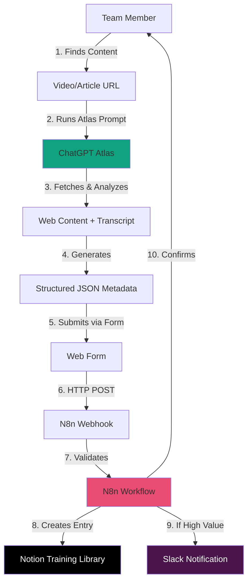
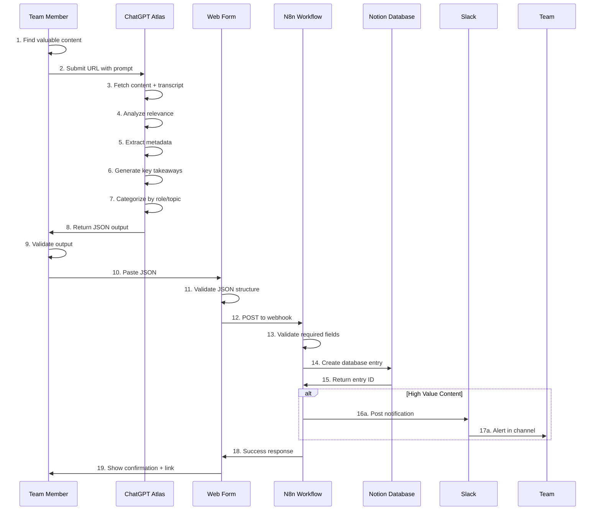
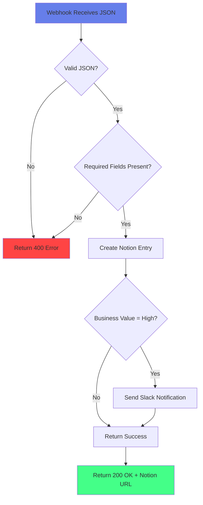
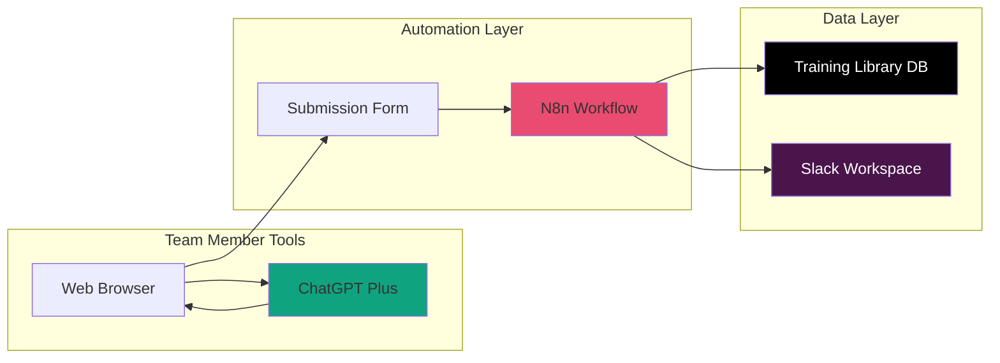
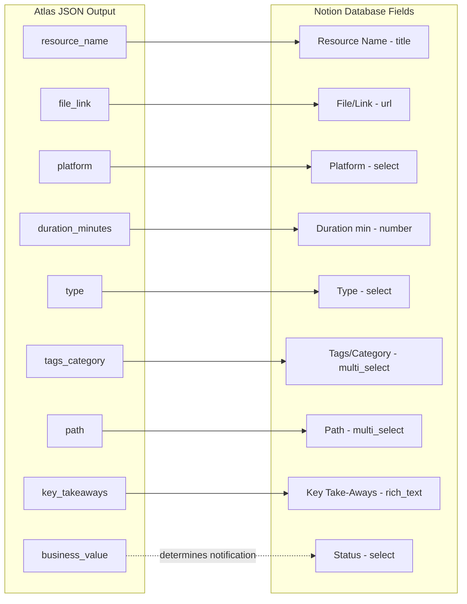
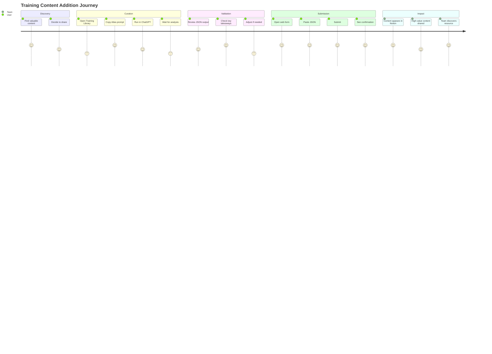
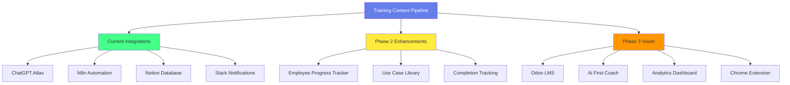

# Training Content Pipeline - System Diagram

## High-Level Architecture



## Detailed Data Flow



## N8n Workflow Logic



## Component Relationships



## Data Schema Mapping



## User Journey



## System Integration Overview

```
┌─────────────────────────────────────────────────────────────┐
│                     Training Content Pipeline                │
└─────────────────────────────────────────────────────────────┘
                              │
        ┌─────────────────────┼─────────────────────┐
        │                     │                     │
        ▼                     ▼                     ▼
┌───────────────┐     ┌───────────────┐    ┌───────────────┐
│   ChatGPT     │     │     N8n       │    │    Notion     │
│    Atlas      │     │  Automation   │    │   Database    │
│               │     │               │    │               │
│ • Fetch URL   │────▶│ • Webhook     │───▶│ • Training    │
│ • Analyze     │     │ • Validate    │    │   Library     │
│ • Categorize  │     │ • Transform   │    │ • Employee    │
│ • Extract     │     │ • Notify      │    │   Progress    │
└───────────────┘     └───────────────┘    │   Tracker     │
                              │             └───────────────┘
                              │                     │
                              ▼                     │
                      ┌───────────────┐            │
                      │     Slack     │◀───────────┘
                      │               │
                      │ • Alerts      │
                      │ • Updates     │
                      └───────────────┘
```

## Future Integration Paths



---

## Legend

**Colors in Diagrams:**
- 🟢 Green: Success states / Completed actions
- 🔵 Blue: Active processing / User actions
- 🔴 Red: Error states / Warnings
- 🟣 Purple: External services
- ⚫ Black: Data stores

**Symbols:**
- →  Direct connection
- ⇢  Data flow
- ↔  Bi-directional
- ⋯  Optional/future

---

**Version:** 1.0
**Last Updated:** 2025-11-14
